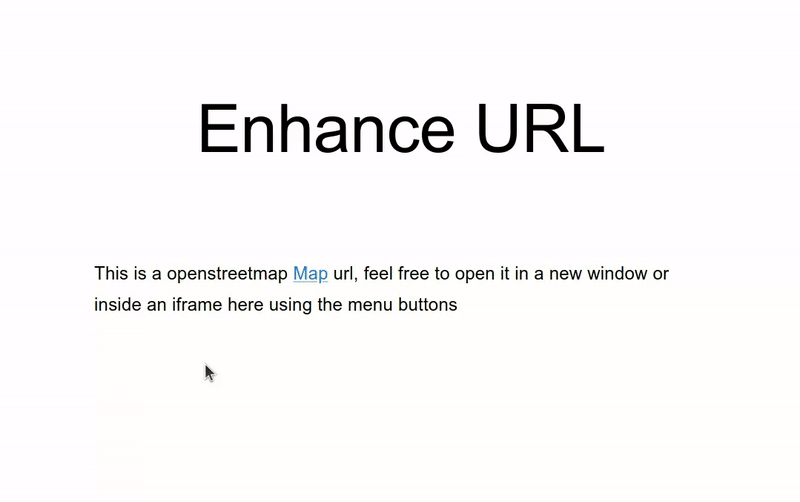

# Enhance URL

This is a minimal React tool to enhance any url to open in an iframe within the page or open in a new window.



## Installation
```
yarn add enhance-url
```

## Usage

```tsx

import EnhanceUrl from './package/enhance-url';

const url = 'https://www.openstreetmap.org/export/embed.html?bbox=-0.004017949104309083%2C51.47612752641776%2C0.00030577182769775396%2C51.478569861898606&layer=mapnik';

<div>
    This is a openstreetmap <EnhanceUrl url={url} text="Map"/> url, feel free to open it in a new window or inside an iframe here using the menu buttons
</div>
```
## Optional props
`Prop name`: [ default value ] - Explanation
<hr>

- `enableIframe`:      [ true ] - Enable/disable the Iframe menu button

- `enableNewWindow`:   [ true ] - Enable/disable the New Window menu button

- `target`:            [ _self ] - Change the default click behaviour to open in the same tab/new tab etc

- `sx`:   [ { } ] - You can style the url by passing any valid [SX Material UI](https://mui.com/system/the-sx-prop/) styles

Any suggestions are more than welcome :)
